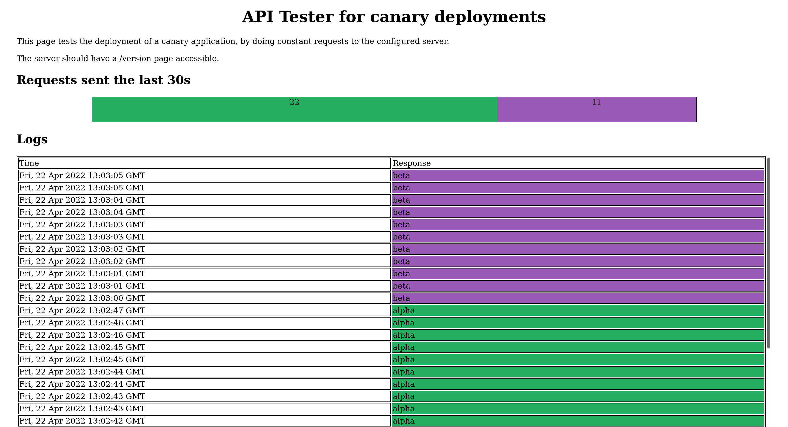

# Canary Deployment UI

This is a simple UI meant to test and demonstrate a blue-green or a canary deployment. It will query the `/version` URI of the same host to check if there are any changes.

## Preview

## How to use

There are multiple available tags on the dockerhub repository. Use the `latest` tag (or greatest) to access the WEBUI, then start your deployment using any other version. all versions should work as webui, however the latest will be the cleanest.

For each version there will be two semi-identical images, `ying` and `yang`.

The image is published on the repository [kalioz/canary-deployment-ui](https://hub.docker.com/r/kalioz/canary-deployment-ui)

See [kalioz/canary-deployment-ui](https://github.com/kalioz/canary-deployment-ui) for more information.